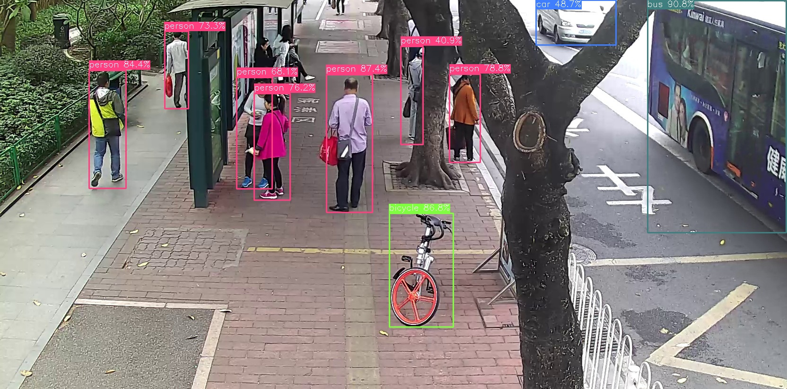

# YoloV8-ncnn

## How to run
run `build/bin/yolov8` for any img/video(must be .mp4) input
```
cd build/bin
./yolov8 img|video filepath [modelpathWithoutExt]
# for video
./yolov8 video ../../video/test.mp4 ../../model/yolov8s
# for img
./yolov8 img ../../img/busstop.jpg ../../model/yolov8s
```
## About validation/test
run `build/test/coco/vali_coco` for coco validation
```
cd build/bin/test/coco
./vali_coco
```
## Modificatoin
### Display

- only draw when detect man/car/bus/...
- use different colors for each class of bouding box
### Output files' saving
- imgs under ./build/output/img
- videos under ./build/output/video
### Padding
- only use bottom/right padding(like yolox)
### Params
argv for `./yolov8 img|video filepath [modelpathWithoutExt]`
